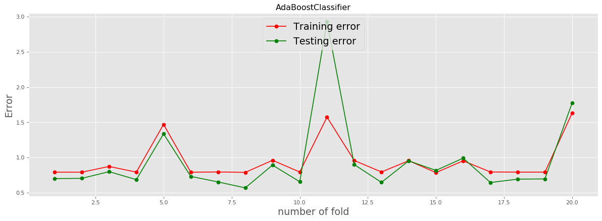
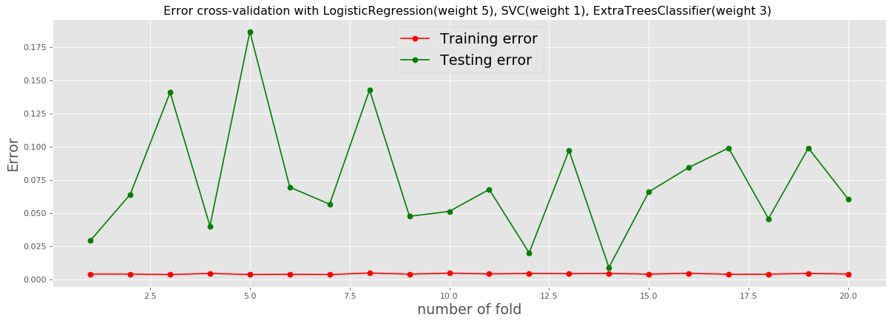
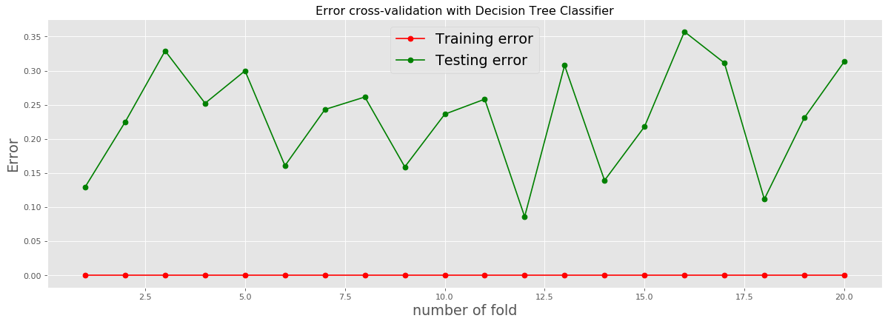
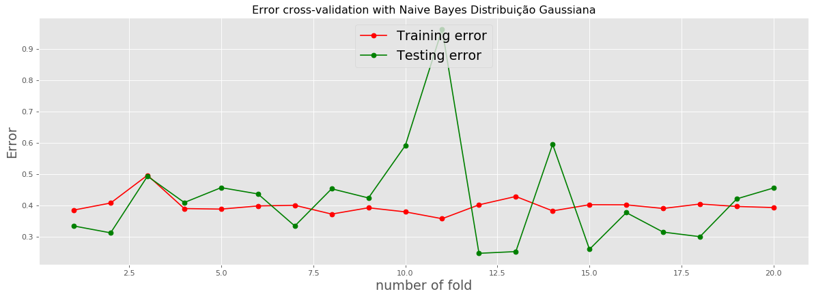
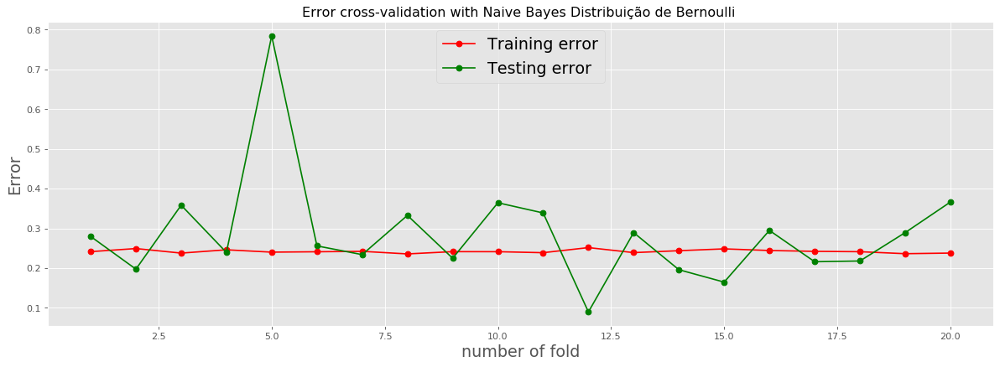

# Labels


```python
import pandas as pd
import numpy as np

path_labels = '/Users/Venicius/Desktop/AM2020 trabalho final/HAPT Data Set/RawData/labels.txt'
column_names_labels = ['Exp_ID','User_ID','Activ_ID','Label_Start','Label_End']
labels = pd.read_csv(path_labels, sep=' ', header=None, names=column_names_labels )
labels[0:3]
```


<div>
<style scoped>
    .dataframe tbody tr th:only-of-type {
        vertical-align: middle;
    }

    .dataframe tbody tr th {
        vertical-align: top;
    }

    .dataframe thead th {
        text-align: right;
    }
</style>
<table border="1" class="dataframe">
  <thead>
    <tr style="text-align: right;">
      <th></th>
      <th>Exp_ID</th>
      <th>User_ID</th>
      <th>Activ_ID</th>
      <th>Label_Start</th>
      <th>Label_End</th>
    </tr>
  </thead>
  <tbody>
    <tr>
      <td>0</td>
      <td>1</td>
      <td>1</td>
      <td>5</td>
      <td>250</td>
      <td>1232</td>
    </tr>
    <tr>
      <td>1</td>
      <td>1</td>
      <td>1</td>
      <td>7</td>
      <td>1233</td>
      <td>1392</td>
    </tr>
    <tr>
      <td>2</td>
      <td>1</td>
      <td>1</td>
      <td>4</td>
      <td>1393</td>
      <td>2194</td>
    </tr>
  </tbody>
</table>
</div>


# Activity_labels


```python
path_alabels = '/Users/Venicius/Desktop/AM2020 trabalho final/HAPT Data Set/activity_labels.txt'
column_names_alabels = ['index','Str_activity']
alabels = pd.read_csv(path_alabels, sep=' ', header=None, names=column_names_alabels )
##alabels.loc[1, 'Str_activity']
#alabels[0:3]
alabels
```


<div>
<style scoped>
    .dataframe tbody tr th:only-of-type {
        vertical-align: middle;
    }

    .dataframe tbody tr th {
        vertical-align: top;
    }

    .dataframe thead th {
        text-align: right;
    }
</style>
<table border="1" class="dataframe">
  <thead>
    <tr style="text-align: right;">
      <th></th>
      <th>index</th>
      <th>Str_activity</th>
    </tr>
  </thead>
  <tbody>
    <tr>
      <td>0</td>
      <td>1</td>
      <td>WALKING</td>
    </tr>
    <tr>
      <td>1</td>
      <td>2</td>
      <td>WALKING_UPSTAIRS</td>
    </tr>
    <tr>
      <td>2</td>
      <td>3</td>
      <td>WALKING_DOWNSTAIRS</td>
    </tr>
    <tr>
      <td>3</td>
      <td>4</td>
      <td>SITTING</td>
    </tr>
    <tr>
      <td>4</td>
      <td>5</td>
      <td>STANDING</td>
    </tr>
    <tr>
      <td>5</td>
      <td>6</td>
      <td>LAYING</td>
    </tr>
    <tr>
      <td>6</td>
      <td>7</td>
      <td>STAND_TO_SIT</td>
    </tr>
    <tr>
      <td>7</td>
      <td>8</td>
      <td>SIT_TO_STAND</td>
    </tr>
    <tr>
      <td>8</td>
      <td>9</td>
      <td>SIT_TO_LIE</td>
    </tr>
    <tr>
      <td>9</td>
      <td>10</td>
      <td>LIE_TO_SIT</td>
    </tr>
    <tr>
      <td>10</td>
      <td>11</td>
      <td>STAND_TO_LIE</td>
    </tr>
    <tr>
      <td>11</td>
      <td>12</td>
      <td>LIE_TO_STAND</td>
    </tr>
  </tbody>
</table>
</div>


# Features


```python
path_features = '/Users/Venicius/Desktop/AM2020 trabalho final/HAPT Data Set/features.txt'
##features = ['Acc_x','Acc_y','Acc_z']
features = pd.read_csv(path_features, header=None )
features = features.loc[0:,0]
b = []
for a in features:
    b.append(a)
features = b
features[0:3]

```


    ['tBodyAcc-Mean-1                ',
     'tBodyAcc-Mean-2                ',
     'tBodyAcc-Mean-3                ']


# Train and test Data Set


```python
from sklearn import metrics

path_X_train = '/Users/Venicius/Desktop/AM2020 trabalho final/HAPT Data Set/Train/X_train.txt'
X_train = pd.read_csv(path_X_train, sep=' ', header=None)
#len(X_train)

path_Y_train = '/Users/Venicius/Desktop/AM2020 trabalho final/HAPT Data Set/Train/y_train.txt'
Y_train = pd.read_csv(path_Y_train, sep=' ', header=None)
#len(Y_train)

path_X_test = '/Users/Venicius/Desktop/AM2020 trabalho final/HAPT Data Set/Test/X_test.txt'
X_test = pd.read_csv(path_X_test, sep=' ', header=None)

path_Y_test = '/Users/Venicius/Desktop/AM2020 trabalho final/HAPT Data Set/Test/y_test.txt'
Y_test = pd.read_csv(path_Y_test, sep=' ', header=None)

#print(len(Y_train), len(X_train), len(X_test), len(Y_test))
```

# Usando AdaBoostClassifier


```python
from sklearn.ensemble import AdaBoostClassifier
import time

ini = time.time()

abc = AdaBoostClassifier(n_estimators= 50, learning_rate=1)

# Treinando o modelo
model = abc.fit(X_train, Y_train.transpose().to_numpy()[0])

# Aplicando o modelo treinado
Y_Previsto_ada = model.predict(X_test)

# Análise da previsão
p_ac = metrics.accuracy_score(Y_test, Y_Previsto_ada)

p_ac   
```


    0.5196078431372549


```python
fim = time.time()
print( "Tempo de execução: " + str(fim-ini))
```

    Tempo de execução: 29.36166763305664
    

# Overfitting x Underfitting


```python
from sklearn.ensemble import AdaBoostClassifier
from sklearn.metrics import mean_absolute_error

abc = AdaBoostClassifier(n_estimators= 50, learning_rate=1)

# Treinando o modelo
model = abc.fit(X_train, Y_train.transpose().to_numpy()[0])

# Aplicando o modelo treinado
Y_train_data_pred = model.predict(X_train)
Y_test_data_pred = model.predict(X_test)
    
training_error = mean_absolute_error(Y_train, Y_train_data_pred) 
testing_error = mean_absolute_error(Y_test, Y_test_data_pred)

print("Training Error: " + str(training_error))
print("Testing Error: " + str(testing_error))
```

    Training Error: 1.6305499373976693
    Testing Error: 1.7747252747252746
    

# Usando KFolds cross-validation para avaliar a capacidade de generalização do AdaBoostClassifier


```python
from sklearn.neural_network import MLPRegressor 
from sklearn.metrics import mean_absolute_error
import numpy as np
from sklearn.model_selection import validation_curve
from sklearn.datasets import load_iris
import matplotlib.pyplot as plt
from matplotlib.pyplot import figure
from sklearn.model_selection import KFold
np.random.seed(0)
plt.style.use('ggplot')

from sklearn.ensemble import AdaBoostClassifier

import warnings
warnings.filterwarnings('ignore')

from sklearn import metrics

path_X_train = '/Users/Venicius/Desktop/AM2020 trabalho final/HAPT Data Set/Train/X_train.txt'
X_train = pd.read_csv(path_X_train, sep=' ', header=None)
#len(X_train)

path_Y_train = '/Users/Venicius/Desktop/AM2020 trabalho final/HAPT Data Set/Train/y_train.txt'
Y_train = pd.read_csv(path_Y_train, sep=' ', header=None)
#len(Y_train)

path_X_test = '/Users/Venicius/Desktop/AM2020 trabalho final/HAPT Data Set/Test/X_test.txt'
X_test = pd.read_csv(path_X_test, sep=' ', header=None)

path_Y_test = '/Users/Venicius/Desktop/AM2020 trabalho final/HAPT Data Set/Test/y_test.txt'
Y_test = pd.read_csv(path_Y_test, sep=' ', header=None)

#print(len(Y_train), len(X_train), len(X_test), len(Y_test))

X = pd.concat( [X_train, X_test])
Y = pd.concat( [Y_train, Y_test])


kf = KFold(n_splits=20)

list_training_error = []
list_testing_error = []

for train_index, test_index in kf.split(X):
    X_train, X_test = X.iloc[ train_index], X.iloc[ test_index]
    Y_train, Y_test = Y.iloc[ train_index], Y.iloc[ test_index]

    # Classificadores
    abc = AdaBoostClassifier(n_estimators= 50, learning_rate=1)
   
    # treinamento

    abc = abc.fit(X_train, Y_train.transpose().to_numpy()[0])

    Y_train_data_pred = abc.predict(X_train)
    Y_test_data_pred = abc.predict(X_test)
    
    
    fold_training_error = mean_absolute_error(Y_train, Y_train_data_pred) 
    fold_testing_error = mean_absolute_error(Y_test, Y_test_data_pred)
    
    list_training_error.append(fold_training_error)
    list_testing_error.append(fold_testing_error) 
```


```python
    
figure(num=None, figsize=(40, 6), dpi=80, facecolor='w', edgecolor='k')
plt.subplot(1,2,1)
plt.plot(range(1, kf.get_n_splits() + 1), np.array(list_training_error).ravel(), 'o-', label='Training error', color='red')
plt.xlabel('number of fold')
#plt.ylabel('training error')
plt.title('Training error across folds')
#plt.tight_layout()


plt.subplot(1,2,1)
plt.plot(range(1, kf.get_n_splits() + 1), np.array(list_testing_error).ravel(), 'o-', label='Testing error', color='green')
plt.xlabel('number of fold', fontsize='xx-large')
plt.ylabel('Error',fontsize='xx-large' )
plt.title('AdaBoostClassifier')
#plt.tight_layout()
plt.legend(['Training error', 'Testing error'], loc=9, fontsize='xx-large')
plt.show()  
```





# Usando AdaBoostClassifier com base estimator diferente, por padrão ele usa DecisionTreeClassifier. AdaBoostClassifier com Support Vector Classifier


```python
from sklearn.ensemble import AdaBoostClassifier
from sklearn.svm import SVC
import time

ini = time.time()

svc=SVC(probability=True, kernel='linear')

abc =AdaBoostClassifier(n_estimators=50, base_estimator=svc,learning_rate=1)
model = abc.fit(X_train, Y_train.transpose().to_numpy()[0])

Y_previsto_ADAB_SVC = model.predict(X_test)

# Análise da previsão
p_ac = metrics.accuracy_score(Y_test, Y_previsto_ADAB_SVC)
p_ac
```


    0.6948134092346616


```python
fim = time.time()
print( "Tempo de execução: " + str(fim-ini))
```

    Tempo de execução: 25587.353974103928
    

# Usando VotingClassifier com: DecisionTreeClassifier, LogisticRegression, GaussianNB, RandomForestClassifier, SVC, ExtraTreesClassifier


```python
from sklearn.tree import DecisionTreeClassifier
from sklearn.linear_model import LogisticRegression
from sklearn.naive_bayes import GaussianNB
from sklearn.ensemble import RandomForestClassifier
from sklearn.svm import SVC
from sklearn.ensemble import ExtraTreesClassifier

from sklearn.ensemble import VotingClassifier

import warnings
warnings.filterwarnings('ignore')

import time

ini = time.time()

# Classificadores
clf1 = DecisionTreeClassifier(max_depth=4)
clf2 = LogisticRegression(random_state=0)
clf3 = GaussianNB()
clf4 = RandomForestClassifier(n_estimators=50, random_state=1)
clf5 = SVC(kernel='rbf', probability=True)
clf6 = ExtraTreesClassifier(n_estimators=100, random_state=0)

eclf = VotingClassifier(estimators=[('dt', clf1), ('lr', clf2), ('gnb', clf3), ('rfc', clf4), ('svc', clf5), ('etc', clf6)], voting='soft', weights=[1, 1, 1, 1, 1, 1])

clf1 = clf1.fit(X_train, Y_train.transpose().to_numpy()[0])
clf2 = clf2.fit(X_train, Y_train.transpose().to_numpy()[0])
clf3 = clf3.fit(X_train, Y_train.transpose().to_numpy()[0])
clf4 = clf4.fit(X_train, Y_train.transpose().to_numpy()[0])
clf5 = clf5.fit(X_train, Y_train.transpose().to_numpy()[0])
clf6 = clf6.fit(X_train, Y_train.transpose().to_numpy()[0])

eclf = eclf.fit(X_train, Y_train.transpose().to_numpy()[0])

Y_previsto_vc = eclf.predict(X_test)

# Análise da previsão
p_ac = metrics.accuracy_score(Y_test, Y_previsto_vc)
p_ac


```


    0.9297912713472486


```python
fim = time.time()
print( "Tempo de execução: " + str(fim-ini))
```

    Tempo de execução: 171.20789122581482
    

# Overfitting x Underfitting


```python
from sklearn.metrics import mean_absolute_error
from sklearn.tree import DecisionTreeClassifier
from sklearn.linear_model import LogisticRegression
from sklearn.naive_bayes import GaussianNB
from sklearn.ensemble import RandomForestClassifier
from sklearn.svm import SVC
from sklearn.ensemble import ExtraTreesClassifier

from sklearn.ensemble import VotingClassifier

import warnings
warnings.filterwarnings('ignore')

# Classificadores
clf1 = DecisionTreeClassifier(max_depth=4)
clf2 = LogisticRegression(random_state=0)
clf3 = GaussianNB()
clf4 = RandomForestClassifier(n_estimators=50, random_state=1)
clf5 = SVC(kernel='rbf', probability=True)
clf6 = ExtraTreesClassifier(n_estimators=100, random_state=0)

eclf = VotingClassifier(estimators=[('dt', clf1), ('lr', clf2), ('gnb', clf3), ('rfc', clf4), ('svc', clf5), ('etc', clf6)], voting='soft', weights=[1, 1, 1, 1, 1, 1])

clf1 = clf1.fit(X_train, Y_train.transpose().to_numpy()[0])
clf2 = clf2.fit(X_train, Y_train.transpose().to_numpy()[0])
clf3 = clf3.fit(X_train, Y_train.transpose().to_numpy()[0])
clf4 = clf4.fit(X_train, Y_train.transpose().to_numpy()[0])
clf5 = clf5.fit(X_train, Y_train.transpose().to_numpy()[0])
clf6 = clf6.fit(X_train, Y_train.transpose().to_numpy()[0])

eclf = eclf.fit(X_train, Y_train.transpose().to_numpy()[0])


# Aplicando o modelo treinado
Y_train_data_pred = eclf.predict(X_train)
Y_test_data_pred = eclf.predict(X_test)
    
training_error = mean_absolute_error(Y_train, Y_train_data_pred) 
testing_error = mean_absolute_error(Y_test, Y_test_data_pred)

print("Training Error: " + str(training_error))
print("Testing Error: " + str(testing_error))
```

    Training Error: 0.010594240585572571
    Testing Error: 0.06593406593406594
    

# Usando KFolds cross-validation para avaliar a capacidade de generalização do VotingClassifier com: DecisionTreeClassifier, LogisticRegression, GaussianNB, RandomForestClassifier, SVC, ExtraTreesClassifier


```python
from sklearn.neural_network import MLPRegressor 
from sklearn.metrics import mean_absolute_error
import numpy as np
from sklearn.model_selection import validation_curve
from sklearn.datasets import load_iris
import matplotlib.pyplot as plt
from matplotlib.pyplot import figure
from sklearn.model_selection import KFold
np.random.seed(0)
plt.style.use('ggplot')

from sklearn.tree import DecisionTreeClassifier
from sklearn.linear_model import LogisticRegression
from sklearn.naive_bayes import GaussianNB
from sklearn.ensemble import RandomForestClassifier
from sklearn.svm import SVC
from sklearn.ensemble import ExtraTreesClassifier

from sklearn.ensemble import VotingClassifier

import warnings
warnings.filterwarnings('ignore')

from sklearn import metrics

path_X_train = '/Users/Venicius/Desktop/AM2020 trabalho final/HAPT Data Set/Train/X_train.txt'
X_train = pd.read_csv(path_X_train, sep=' ', header=None)
#len(X_train)

path_Y_train = '/Users/Venicius/Desktop/AM2020 trabalho final/HAPT Data Set/Train/y_train.txt'
Y_train = pd.read_csv(path_Y_train, sep=' ', header=None)
#len(Y_train)

path_X_test = '/Users/Venicius/Desktop/AM2020 trabalho final/HAPT Data Set/Test/X_test.txt'
X_test = pd.read_csv(path_X_test, sep=' ', header=None)

path_Y_test = '/Users/Venicius/Desktop/AM2020 trabalho final/HAPT Data Set/Test/y_test.txt'
Y_test = pd.read_csv(path_Y_test, sep=' ', header=None)

#print(len(Y_train), len(X_train), len(X_test), len(Y_test))

X = pd.concat( [X_train, X_test])
Y = pd.concat( [Y_train, Y_test])


kf = KFold(n_splits=20)

list_training_error = []
list_testing_error = []

for train_index, test_index in kf.split(X):
    X_train, X_test = X.iloc[ train_index], X.iloc[ test_index]
    Y_train, Y_test = Y.iloc[ train_index], Y.iloc[ test_index]

    # Classificadores
    clf1 = DecisionTreeClassifier(max_depth=4)
    clf2 = LogisticRegression(random_state=0)
    clf3 = GaussianNB()
    clf4 = RandomForestClassifier(n_estimators=50, random_state=1)
    clf5 = SVC(kernel='rbf', probability=True)
    clf6 = ExtraTreesClassifier(n_estimators=100, random_state=0)

    eclf = VotingClassifier(estimators=[('dt', clf1), ('lr', clf2), ('gnb', clf3), ('rfc', clf4), ('svc', clf5), ('etc', clf6)], voting='soft', weights=[1, 1, 1, 1, 1, 1])

    clf1 = clf1.fit(X_train, Y_train.transpose().to_numpy()[0])
    clf2 = clf2.fit(X_train, Y_train.transpose().to_numpy()[0])
    clf3 = clf3.fit(X_train, Y_train.transpose().to_numpy()[0])
    clf4 = clf4.fit(X_train, Y_train.transpose().to_numpy()[0])
    clf5 = clf5.fit(X_train, Y_train.transpose().to_numpy()[0])
    clf6 = clf6.fit(X_train, Y_train.transpose().to_numpy()[0])

    eclf = eclf.fit(X_train, Y_train.transpose().to_numpy()[0])

    Y_train_data_pred = eclf.predict(X_train)
    Y_test_data_pred = eclf.predict(X_test)
    
    
    fold_training_error = mean_absolute_error(Y_train, Y_train_data_pred) 
    fold_testing_error = mean_absolute_error(Y_test, Y_test_data_pred)
    
    list_training_error.append(fold_training_error)
    list_testing_error.append(fold_testing_error) 
```


```python
figure(num=None, figsize=(40, 6), dpi=80, facecolor='w', edgecolor='k')
plt.subplot(1,2,1)
plt.plot(range(1, kf.get_n_splits() + 1), np.array(list_training_error).ravel(), 'o-', label='Training error', color='red')
plt.xlabel('number of fold')
#plt.ylabel('training error')
plt.title('Training error across folds')
#plt.tight_layout()


plt.subplot(1,2,1)
plt.plot(range(1, kf.get_n_splits() + 1), np.array(list_testing_error).ravel(), 'o-', label='Testing error', color='green')
plt.xlabel('number of fold', fontsize='xx-large')
plt.ylabel('Error',fontsize='xx-large' )
plt.title('DecisionTreeClassifier(1), LogisticRegression(1), GaussianNB(1), RandomForestClassifier(1), SVC(1), ExtraTreesClassifier(1)')
#plt.tight_layout()
plt.legend(['Training error', 'Testing error'], loc=9, fontsize='xx-large')
plt.show()  
```

# Usando VotingClassifier com: LogisticRegression(peso 3), SVC(peso 1), ExtraTreesClassifier(peso 2)


```python
from sklearn.linear_model import LogisticRegression
from sklearn.svm import SVC
from sklearn.ensemble import ExtraTreesClassifier

from sklearn.ensemble import VotingClassifier

import warnings
warnings.filterwarnings('ignore')

import time

ini = time.time()

# Classificadores
clf2 = LogisticRegression(random_state=0)
clf5 = SVC(kernel='rbf', probability=True)
clf6 = ExtraTreesClassifier(n_estimators=100, random_state=0)

eclf = VotingClassifier(estimators=[ ('lr', clf2), ('svc', clf5), ('etc', clf6)], voting='soft', weights=[3, 1, 2])

clf2 = clf2.fit(X_train, Y_train.transpose().to_numpy()[0])
clf5 = clf5.fit(X_train, Y_train.transpose().to_numpy()[0])
clf6 = clf6.fit(X_train, Y_train.transpose().to_numpy()[0])

eclf = eclf.fit(X_train, Y_train.transpose().to_numpy()[0])

Y_previsto_vc2 = eclf.predict(X_test)

# Análise da previsão
p_ac = metrics.accuracy_score(Y_test, Y_previsto_vc2)
p_ac

```


    0.9490828589500316


```python
fim = time.time()
print( "Tempo de execução: " + str(fim-ini))
```

    Tempo de execução: 149.9441740512848
    

# Overfitting x Underfitting


```python
from sklearn.metrics import mean_absolute_error
from sklearn.linear_model import LogisticRegression
from sklearn.svm import SVC
from sklearn.ensemble import ExtraTreesClassifier

from sklearn.ensemble import VotingClassifier

import warnings
warnings.filterwarnings('ignore')

# Classificadores
clf2 = LogisticRegression(random_state=0)
clf5 = SVC(kernel='rbf', probability=True)
clf6 = ExtraTreesClassifier(n_estimators=100, random_state=0)

eclf = VotingClassifier(estimators=[ ('lr', clf2), ('svc', clf5), ('etc', clf6)], voting='soft', weights=[3, 1, 2])

clf2 = clf2.fit(X_train, Y_train.transpose().to_numpy()[0])
clf5 = clf5.fit(X_train, Y_train.transpose().to_numpy()[0])
clf6 = clf6.fit(X_train, Y_train.transpose().to_numpy()[0])

eclf = eclf.fit(X_train, Y_train.transpose().to_numpy()[0])

# Aplicando o modelo treinado
Y_train_data_pred = eclf.predict(X_train)
Y_test_data_pred = eclf.predict(X_test)
    
training_error = mean_absolute_error(Y_train, Y_train_data_pred) 
testing_error = mean_absolute_error(Y_test, Y_test_data_pred)

print("Training Error: " + str(training_error))
print("Testing Error: " + str(testing_error))
```

    Training Error: 0.003948762400077049
    Testing Error: 0.06227106227106227
    

# Usando KFolds cross-validation para avaliar a capacidade de generalização do VotingClassifier com: LogisticRegression(peso 3), SVC(peso 1), ExtraTreesClassifier(peso 2)


```python
from sklearn.neural_network import MLPRegressor 
from sklearn.metrics import mean_absolute_error
import numpy as np
from sklearn.model_selection import validation_curve
from sklearn.datasets import load_iris
import matplotlib.pyplot as plt
from matplotlib.pyplot import figure
from sklearn.model_selection import KFold
np.random.seed(0)
plt.style.use('ggplot')

from sklearn.linear_model import LogisticRegression
from sklearn.svm import SVC
from sklearn.ensemble import ExtraTreesClassifier

from sklearn.ensemble import VotingClassifier

import warnings
warnings.filterwarnings('ignore')

from sklearn import metrics

path_X_train = '/Users/Venicius/Desktop/AM2020 trabalho final/HAPT Data Set/Train/X_train.txt'
X_train = pd.read_csv(path_X_train, sep=' ', header=None)
#len(X_train)

path_Y_train = '/Users/Venicius/Desktop/AM2020 trabalho final/HAPT Data Set/Train/y_train.txt'
Y_train = pd.read_csv(path_Y_train, sep=' ', header=None)
#len(Y_train)

path_X_test = '/Users/Venicius/Desktop/AM2020 trabalho final/HAPT Data Set/Test/X_test.txt'
X_test = pd.read_csv(path_X_test, sep=' ', header=None)

path_Y_test = '/Users/Venicius/Desktop/AM2020 trabalho final/HAPT Data Set/Test/y_test.txt'
Y_test = pd.read_csv(path_Y_test, sep=' ', header=None)

#print(len(Y_train), len(X_train), len(X_test), len(Y_test))

X = pd.concat( [X_train, X_test])
Y = pd.concat( [Y_train, Y_test])


kf = KFold(n_splits=20)

list_training_error = []
list_testing_error = []

for train_index, test_index in kf.split(X):
    X_train, X_test = X.iloc[ train_index], X.iloc[ test_index]
    Y_train, Y_test = Y.iloc[ train_index], Y.iloc[ test_index]

    # Classificadores
    clf2 = LogisticRegression(random_state=0)
    clf5 = SVC(kernel='rbf', probability=True)
    clf6 = ExtraTreesClassifier(n_estimators=100, random_state=0)

    eclf = VotingClassifier(estimators=[ ('lr', clf2), ('svc', clf5), ('etc', clf6)], voting='soft', weights=[3, 1, 2])

    clf2 = clf2.fit(X_train, Y_train.transpose().to_numpy()[0])
    clf5 = clf5.fit(X_train, Y_train.transpose().to_numpy()[0])
    clf6 = clf6.fit(X_train, Y_train.transpose().to_numpy()[0])

    eclf = eclf.fit(X_train, Y_train.transpose().to_numpy()[0])

    Y_train_data_pred = eclf.predict(X_train)
    Y_test_data_pred = eclf.predict(X_test)
    
    
    fold_training_error = mean_absolute_error(Y_train, Y_train_data_pred) 
    fold_testing_error = mean_absolute_error(Y_test, Y_test_data_pred)
    
    list_training_error.append(fold_training_error)
    list_testing_error.append(fold_testing_error) 
```


```python
    
figure(num=None, figsize=(40, 6), dpi=80, facecolor='w', edgecolor='k')
plt.subplot(1,2,1)
plt.plot(range(1, kf.get_n_splits() + 1), np.array(list_training_error).ravel(), 'o-', label='Training error', color='red')
plt.xlabel('number of fold')
#plt.ylabel('training error')
plt.title('Training error across folds')
#plt.tight_layout()


plt.subplot(1,2,1)
plt.plot(range(1, kf.get_n_splits() + 1), np.array(list_testing_error).ravel(), 'o-', label='Testing error', color='green')
plt.xlabel('number of fold', fontsize='xx-large')
plt.ylabel('Error',fontsize='xx-large' )
plt.title('LogisticRegression(3), SVC(1), ExtraTreesClassifier(2)')
#plt.tight_layout()
plt.legend(['Training error', 'Testing error'], loc=9, fontsize='xx-large')
plt.show()  
```

# Usando VotingClassifier com: LogisticRegression(peso 1), SVC(peso 1), ExtraTreesClassifier(peso 1)


```python
from sklearn.linear_model import LogisticRegression
from sklearn.svm import SVC
from sklearn.ensemble import ExtraTreesClassifier

from sklearn.ensemble import VotingClassifier

import warnings
warnings.filterwarnings('ignore')

import time

ini = time.time()

# Classificadores
clf2 = LogisticRegression(random_state=0)
clf5 = SVC(kernel='rbf', probability=True)
clf6 = ExtraTreesClassifier(n_estimators=100, random_state=0)

eclf = VotingClassifier(estimators=[ ('lr', clf2), ('svc', clf5), ('etc', clf6)], voting='soft', weights=[1, 1, 1])

clf2 = clf2.fit(X_train, Y_train.transpose().to_numpy()[0])
clf5 = clf5.fit(X_train, Y_train.transpose().to_numpy()[0])
clf6 = clf6.fit(X_train, Y_train.transpose().to_numpy()[0])

eclf = eclf.fit(X_train, Y_train.transpose().to_numpy()[0])

Y_previsto_vc2 = eclf.predict(X_test)

# Análise da previsão
p_ac = metrics.accuracy_score(Y_test, Y_previsto_vc2)
p_ac
```


    0.948450347881088


```python
fim = time.time()
print( "Tempo de execução: " + str(fim-ini))
```

    Tempo de execução: 153.9640815258026
    

# Overfitting x Underfitting


```python
from sklearn.metrics import mean_absolute_error
from sklearn.linear_model import LogisticRegression
from sklearn.svm import SVC
from sklearn.ensemble import ExtraTreesClassifier

from sklearn.ensemble import VotingClassifier

import warnings
warnings.filterwarnings('ignore')

# Classificadores
clf2 = LogisticRegression(random_state=0)
clf5 = SVC(kernel='rbf', probability=True)
clf6 = ExtraTreesClassifier(n_estimators=100, random_state=0)

eclf = VotingClassifier(estimators=[ ('lr', clf2), ('svc', clf5), ('etc', clf6)], voting='soft', weights=[1, 1, 1])

clf2 = clf2.fit(X_train, Y_train.transpose().to_numpy()[0])
clf5 = clf5.fit(X_train, Y_train.transpose().to_numpy()[0])
clf6 = clf6.fit(X_train, Y_train.transpose().to_numpy()[0])

eclf = eclf.fit(X_train, Y_train.transpose().to_numpy()[0])

# Aplicando o modelo treinado
Y_train_data_pred = eclf.predict(X_train)
Y_test_data_pred = eclf.predict(X_test)
    
training_error = mean_absolute_error(Y_train, Y_train_data_pred) 
testing_error = mean_absolute_error(Y_test, Y_test_data_pred)

print("Training Error: " + str(training_error))
print("Testing Error: " + str(testing_error))
```

    Training Error: 0.004911875180583647
    Testing Error: 0.05860805860805861
    

# Usando KFolds cross-validation para avaliar a capacidade de generalização


```python
from sklearn.neural_network import MLPRegressor 
from sklearn.metrics import mean_absolute_error
import numpy as np
from sklearn.model_selection import validation_curve
from sklearn.datasets import load_iris
import matplotlib.pyplot as plt
from matplotlib.pyplot import figure
from sklearn.model_selection import KFold
np.random.seed(0)
plt.style.use('ggplot')

from sklearn.linear_model import LogisticRegression
from sklearn.svm import SVC
from sklearn.ensemble import ExtraTreesClassifier

from sklearn.ensemble import VotingClassifier

import warnings
warnings.filterwarnings('ignore')

from sklearn import metrics

path_X_train = '/Users/Venicius/Desktop/AM2020 trabalho final/HAPT Data Set/Train/X_train.txt'
X_train = pd.read_csv(path_X_train, sep=' ', header=None)
#len(X_train)

path_Y_train = '/Users/Venicius/Desktop/AM2020 trabalho final/HAPT Data Set/Train/y_train.txt'
Y_train = pd.read_csv(path_Y_train, sep=' ', header=None)
#len(Y_train)

path_X_test = '/Users/Venicius/Desktop/AM2020 trabalho final/HAPT Data Set/Test/X_test.txt'
X_test = pd.read_csv(path_X_test, sep=' ', header=None)

path_Y_test = '/Users/Venicius/Desktop/AM2020 trabalho final/HAPT Data Set/Test/y_test.txt'
Y_test = pd.read_csv(path_Y_test, sep=' ', header=None)

#print(len(Y_train), len(X_train), len(X_test), len(Y_test))

X = pd.concat( [X_train, X_test])
Y = pd.concat( [Y_train, Y_test])


kf = KFold(n_splits=20)

list_training_error = []
list_testing_error = []

for train_index, test_index in kf.split(X):
    X_train, X_test = X.iloc[ train_index], X.iloc[ test_index]
    Y_train, Y_test = Y.iloc[ train_index], Y.iloc[ test_index]

    # Classificadores
    clf2 = LogisticRegression(random_state=0)
    clf5 = SVC(kernel='rbf', probability=True)
    clf6 = ExtraTreesClassifier(n_estimators=100, random_state=0)

    eclf = VotingClassifier(estimators=[ ('lr', clf2), ('svc', clf5), ('etc', clf6)], voting='soft', weights=[1, 1, 1])

    clf2 = clf2.fit(X_train, Y_train.transpose().to_numpy()[0])
    clf5 = clf5.fit(X_train, Y_train.transpose().to_numpy()[0])
    clf6 = clf6.fit(X_train, Y_train.transpose().to_numpy()[0])

    eclf = eclf.fit(X_train, Y_train.transpose().to_numpy()[0])

    Y_train_data_pred = eclf.predict(X_train)
    Y_test_data_pred = eclf.predict(X_test)
    
    
    fold_training_error = mean_absolute_error(Y_train, Y_train_data_pred) 
    fold_testing_error = mean_absolute_error(Y_test, Y_test_data_pred)
    
    list_training_error.append(fold_training_error)
    list_testing_error.append(fold_testing_error) 
```


```python
    
figure(num=None, figsize=(40, 6), dpi=80, facecolor='w', edgecolor='k')
plt.subplot(1,2,1)
plt.plot(range(1, kf.get_n_splits() + 1), np.array(list_training_error).ravel(), 'o-', label='Training error', color='red')
plt.xlabel('number of fold')
#plt.ylabel('training error')
plt.title('Training error across folds')
#plt.tight_layout()


plt.subplot(1,2,1)
plt.plot(range(1, kf.get_n_splits() + 1), np.array(list_testing_error).ravel(), 'o-', label='Testing error', color='green')
plt.xlabel('number of fold', fontsize='xx-large')
plt.ylabel('Error',fontsize='xx-large' )
plt.title('LogisticRegression(1), SVC(1), ExtraTreesClassifier(1)')
#plt.tight_layout()
plt.legend(['Training error', 'Testing error'], loc=9, fontsize='xx-large')
plt.show()  
```

# Usando VotingClassifier com: LogisticRegression(peso 5), SVC(peso 1), ExtraTreesClassifier(peso 3)


```python
from sklearn.linear_model import LogisticRegression
from sklearn.svm import SVC
from sklearn.ensemble import ExtraTreesClassifier

from sklearn.ensemble import VotingClassifier

import warnings
warnings.filterwarnings('ignore')

import time

ini = time.time()

# Classificadores
clf2 = LogisticRegression(random_state=0)
clf5 = SVC(kernel='rbf', probability=True)
clf6 = ExtraTreesClassifier(n_estimators=100, random_state=0)

eclf = VotingClassifier(estimators=[ ('lr', clf2), ('svc', clf5), ('etc', clf6)], voting='soft', weights=[5, 1, 3])

clf2 = clf2.fit(X_train, Y_train.transpose().to_numpy()[0])
clf5 = clf5.fit(X_train, Y_train.transpose().to_numpy()[0])
clf6 = clf6.fit(X_train, Y_train.transpose().to_numpy()[0])

eclf = eclf.fit(X_train, Y_train.transpose().to_numpy()[0])

Y_previsto_vc2 = eclf.predict(X_test)

# Análise da previsão
p_ac = metrics.accuracy_score(Y_test, Y_previsto_vc2)
p_ac
```


    0.9500316255534472


```python
fim = time.time()
print( "Tempo de execução: " + str(fim-ini))
```

    Tempo de execução: 145.84465742111206
    

# Overfitting x Underfitting


```python
from sklearn.metrics import mean_absolute_error
from sklearn.linear_model import LogisticRegression
from sklearn.svm import SVC
from sklearn.ensemble import ExtraTreesClassifier

from sklearn.ensemble import VotingClassifier

import warnings
warnings.filterwarnings('ignore')

# Classificadores
clf2 = LogisticRegression(random_state=0)
clf5 = SVC(kernel='rbf', probability=True)
clf6 = ExtraTreesClassifier(n_estimators=100, random_state=0)

eclf = VotingClassifier(estimators=[ ('lr', clf2), ('svc', clf5), ('etc', clf6)], voting='soft', weights=[5, 1, 3])

clf2 = clf2.fit(X_train, Y_train.transpose().to_numpy()[0])
clf5 = clf5.fit(X_train, Y_train.transpose().to_numpy()[0])
clf6 = clf6.fit(X_train, Y_train.transpose().to_numpy()[0])

eclf = eclf.fit(X_train, Y_train.transpose().to_numpy()[0])

# Aplicando o modelo treinado
Y_train_data_pred = eclf.predict(X_train)
Y_test_data_pred = eclf.predict(X_test)
    
training_error = mean_absolute_error(Y_train, Y_train_data_pred) 
testing_error = mean_absolute_error(Y_test, Y_test_data_pred)

print("Training Error: " + str(training_error))
print("Testing Error: " + str(testing_error))
```

    Training Error: 0.004141384956178369
    Testing Error: 0.06043956043956044
    

# Usando KFolds cross-validation para avaliar a capacidade de generalização com LogisticRegression(peso 5), SVC(peso 1), ExtraTreesClassifier(peso 3)


```python
from sklearn.neural_network import MLPRegressor 
from sklearn.metrics import mean_absolute_error
import numpy as np
from sklearn.model_selection import validation_curve
from sklearn.datasets import load_iris
import matplotlib.pyplot as plt
from matplotlib.pyplot import figure
from sklearn.model_selection import KFold
np.random.seed(0)
plt.style.use('ggplot')

from sklearn.linear_model import LogisticRegression
from sklearn.svm import SVC
from sklearn.ensemble import ExtraTreesClassifier

from sklearn.ensemble import VotingClassifier

import warnings
warnings.filterwarnings('ignore')

from sklearn import metrics

path_X_train = '/Users/Venicius/Desktop/AM2020 trabalho final/HAPT Data Set/Train/X_train.txt'
X_train = pd.read_csv(path_X_train, sep=' ', header=None)
#len(X_train)

path_Y_train = '/Users/Venicius/Desktop/AM2020 trabalho final/HAPT Data Set/Train/y_train.txt'
Y_train = pd.read_csv(path_Y_train, sep=' ', header=None)
#len(Y_train)

path_X_test = '/Users/Venicius/Desktop/AM2020 trabalho final/HAPT Data Set/Test/X_test.txt'
X_test = pd.read_csv(path_X_test, sep=' ', header=None)

path_Y_test = '/Users/Venicius/Desktop/AM2020 trabalho final/HAPT Data Set/Test/y_test.txt'
Y_test = pd.read_csv(path_Y_test, sep=' ', header=None)

#print(len(Y_train), len(X_train), len(X_test), len(Y_test))

X = pd.concat( [X_train, X_test])
Y = pd.concat( [Y_train, Y_test])


kf = KFold(n_splits=20)

list_training_error = []
list_testing_error = []

for train_index, test_index in kf.split(X):
    X_train, X_test = X.iloc[ train_index], X.iloc[ test_index]
    Y_train, Y_test = Y.iloc[ train_index], Y.iloc[ test_index]

    clf2 = LogisticRegression(random_state=0)
    clf5 = SVC(kernel='rbf', probability=True)
    clf6 = ExtraTreesClassifier(n_estimators=100, random_state=0)
    
    eclf = VotingClassifier(estimators=[ ('lr', clf2), ('svc', clf5), ('etc', clf6)], voting='soft', weights=[5, 1, 3])

    clf2 = clf2.fit(X_train, Y_train.transpose().to_numpy()[0])
    clf5 = clf5.fit(X_train, Y_train.transpose().to_numpy()[0])
    clf6 = clf6.fit(X_train, Y_train.transpose().to_numpy()[0])

    eclf = eclf.fit(X_train, Y_train.transpose().to_numpy()[0])
    
    
    Y_train_data_pred = eclf.predict(X_train)
    Y_test_data_pred = eclf.predict(X_test)
    
    
    fold_training_error = mean_absolute_error(Y_train, Y_train_data_pred) 
    fold_testing_error = mean_absolute_error(Y_test, Y_test_data_pred)
    
    list_training_error.append(fold_training_error)
    list_testing_error.append(fold_testing_error) 
```


```python
figure(num=None, figsize=(40, 6), dpi=80, facecolor='w', edgecolor='k')
plt.subplot(1,2,1)
plt.plot(range(1, kf.get_n_splits() + 1), np.array(list_training_error).ravel(), 'o-', label='Training error', color='red')
plt.xlabel('number of fold')
#plt.ylabel('training error')
plt.title('Training error across folds')
#plt.tight_layout()


plt.subplot(1,2,1)
plt.plot(range(1, kf.get_n_splits() + 1), np.array(list_testing_error).ravel(), 'o-', label='Testing error', color='green')
plt.xlabel('number of fold', fontsize='xx-large')
plt.ylabel('Error',fontsize='xx-large' )
plt.title('Error cross-validation with LogisticRegression(weight 5), SVC(weight 1), ExtraTreesClassifier(weight 3) ')
#plt.tight_layout()
plt.legend(['Training error', 'Testing error'], loc=9, fontsize='xx-large')
plt.show() 
```





```python
for a in range(0,20) :
    print("{0:.3f}  {1:.3f}".format( list_training_error[a], list_testing_error[a]))
```

    0.004  0.029
    0.004  0.064
    0.004  0.141
    0.005  0.040
    0.004  0.186
    0.004  0.069
    0.004  0.057
    0.005  0.143
    0.004  0.048
    0.005  0.051
    0.004  0.068
    0.005  0.020
    0.004  0.097
    0.005  0.009
    0.004  0.066
    0.005  0.084
    0.004  0.099
    0.004  0.046
    0.005  0.099
    0.004  0.060
    

# Usando Decision Tree Classifier


```python
import time

ini = time.time()


from sklearn.tree import DecisionTreeClassifier
dtc = DecisionTreeClassifier(random_state=0)
dtc.fit(X_train, Y_train.transpose().to_numpy()[0])
Y_previsto_DTC = dtc.predict(X_test)

# Análise da previsão
p_ac = metrics.accuracy_score(Y_test, Y_previsto_DTC)
p_ac
```


    0.8020240354206198


```python
fim = time.time()
print( "Tempo de execução: " + str(fim-ini))
```

    Tempo de execução: 5.718120813369751
    

# Overfitting x Underfitting


```python
from sklearn.metrics import mean_absolute_error
from sklearn.tree import DecisionTreeClassifier
dtc = DecisionTreeClassifier(random_state=0)
dtc = dtc.fit(X_train, Y_train.transpose().to_numpy()[0])

# Aplicando o modelo treinado
Y_train_data_pred = dtc.predict(X_train)
Y_test_data_pred = dtc.predict(X_test)
    
training_error = mean_absolute_error(Y_train, Y_train_data_pred) 
testing_error = mean_absolute_error(Y_test, Y_test_data_pred)

print("Training Error: " + str(training_error))
print("Testing Error: " + str(testing_error))
```

    Training Error: 0.0
    Testing Error: 0.3131868131868132
    

# Usando KFolds cross-validation para avaliar a capacidade de generalização com Decision Tree Classifier


```python
from sklearn.neural_network import MLPRegressor 
from sklearn.metrics import mean_absolute_error
import numpy as np
from sklearn.model_selection import validation_curve
from sklearn.datasets import load_iris
import matplotlib.pyplot as plt
from matplotlib.pyplot import figure
from sklearn.model_selection import KFold
np.random.seed(0)
plt.style.use('ggplot')

from sklearn.tree import DecisionTreeClassifier

import warnings
warnings.filterwarnings('ignore')

from sklearn import metrics

path_X_train = '/Users/Venicius/Desktop/AM2020 trabalho final/HAPT Data Set/Train/X_train.txt'
X_train = pd.read_csv(path_X_train, sep=' ', header=None)
#len(X_train)

path_Y_train = '/Users/Venicius/Desktop/AM2020 trabalho final/HAPT Data Set/Train/y_train.txt'
Y_train = pd.read_csv(path_Y_train, sep=' ', header=None)
#len(Y_train)

path_X_test = '/Users/Venicius/Desktop/AM2020 trabalho final/HAPT Data Set/Test/X_test.txt'
X_test = pd.read_csv(path_X_test, sep=' ', header=None)

path_Y_test = '/Users/Venicius/Desktop/AM2020 trabalho final/HAPT Data Set/Test/y_test.txt'
Y_test = pd.read_csv(path_Y_test, sep=' ', header=None)

#print(len(Y_train), len(X_train), len(X_test), len(Y_test))

X = pd.concat( [X_train, X_test])
Y = pd.concat( [Y_train, Y_test])


kf = KFold(n_splits=20)

list_training_error = []
list_testing_error = []

for train_index, test_index in kf.split(X):
    X_train, X_test = X.iloc[ train_index], X.iloc[ test_index]
    Y_train, Y_test = Y.iloc[ train_index], Y.iloc[ test_index]

    dtc = DecisionTreeClassifier(random_state=0)
    dtc = dtc.fit(X_train, Y_train.transpose().to_numpy()[0])
    
    Y_train_data_pred = dtc.predict(X_train)
    Y_test_data_pred = dtc.predict(X_test)
    
    fold_training_error = mean_absolute_error(Y_train, Y_train_data_pred) 
    fold_testing_error = mean_absolute_error(Y_test, Y_test_data_pred)
    
    list_training_error.append(fold_training_error)
    list_testing_error.append(fold_testing_error) 
```


```python
figure(num=None, figsize=(40, 6), dpi=80, facecolor='w', edgecolor='k')
plt.subplot(1,2,1)
plt.plot(range(1, kf.get_n_splits() + 1), np.array(list_training_error).ravel(), 'o-', label='Training error', color='red')
plt.xlabel('number of fold')
#plt.ylabel('training error')
plt.title('Training error across folds')
#plt.tight_layout()


plt.subplot(1,2,1)
plt.plot(range(1, kf.get_n_splits() + 1), np.array(list_testing_error).ravel(), 'o-', label='Testing error', color='green')
plt.xlabel('number of fold', fontsize='xx-large')
plt.ylabel('Error',fontsize='xx-large' )
plt.title('Error cross-validation with Decision Tree Classifier')
#plt.tight_layout()
plt.legend(['Training error', 'Testing error'], loc=9, fontsize='xx-large')
plt.show() 
```





```python
for a in range(0,20) :
    print("{0:.3f}  {1:.3f}".format( list_training_error[a], list_testing_error[a]))
```

    0.000  0.130
    0.000  0.225
    0.000  0.329
    0.000  0.252
    0.000  0.300
    0.000  0.161
    0.000  0.243
    0.000  0.261
    0.000  0.159
    0.000  0.236
    0.000  0.258
    0.000  0.086
    0.000  0.308
    0.000  0.139
    0.000  0.218
    0.000  0.357
    0.000  0.311
    0.000  0.112
    0.000  0.231
    0.000  0.313
    

# Usando Naive Bayes Distribuição Gaussiana


```python
import time

ini = time.time()

from sklearn.naive_bayes import GaussianNB
gnb = GaussianNB()
gnb.fit(X_train, Y_train.transpose().to_numpy()[0] )
Y_previsto_NB_G = gnb.predict(X_test)

# Análise da previsão
p_ac = metrics.accuracy_score(Y_test, Y_previsto_NB_G)
p_ac
```


    0.7473118279569892


```python
fim = time.time()
print( "Tempo de execução: " + str(fim-ini))
```

    Tempo de execução: 0.540687084197998
    

# Overfitting x Underfitting


```python
from sklearn.metrics import mean_absolute_error
from sklearn.naive_bayes import GaussianNB
gnb = GaussianNB()
gnb = gnb.fit(X_train, Y_train.transpose().to_numpy()[0] )


# Aplicando o modelo treinado
Y_train_data_pred = gnb.predict(X_train)
Y_test_data_pred = gnb.predict(X_test)
    
training_error = mean_absolute_error(Y_train, Y_train_data_pred) 
testing_error = mean_absolute_error(Y_test, Y_test_data_pred)

print("Training Error: " + str(training_error))
print("Testing Error: " + str(testing_error))
```

    Training Error: 0.393431570836945
    Testing Error: 0.45604395604395603
    

# Usando KFolds cross-validation para avaliar a capacidade de generalização com Naive Bayes Distribuição Gaussiana


```python
from sklearn.neural_network import MLPRegressor 
from sklearn.metrics import mean_absolute_error
import numpy as np
from sklearn.model_selection import validation_curve
from sklearn.datasets import load_iris
import matplotlib.pyplot as plt
from matplotlib.pyplot import figure
from sklearn.model_selection import KFold
np.random.seed(0)
plt.style.use('ggplot')

from sklearn.naive_bayes import GaussianNB

import warnings
warnings.filterwarnings('ignore')

from sklearn import metrics

path_X_train = '/Users/Venicius/Desktop/AM2020 trabalho final/HAPT Data Set/Train/X_train.txt'
X_train = pd.read_csv(path_X_train, sep=' ', header=None)
#len(X_train)

path_Y_train = '/Users/Venicius/Desktop/AM2020 trabalho final/HAPT Data Set/Train/y_train.txt'
Y_train = pd.read_csv(path_Y_train, sep=' ', header=None)
#len(Y_train)

path_X_test = '/Users/Venicius/Desktop/AM2020 trabalho final/HAPT Data Set/Test/X_test.txt'
X_test = pd.read_csv(path_X_test, sep=' ', header=None)

path_Y_test = '/Users/Venicius/Desktop/AM2020 trabalho final/HAPT Data Set/Test/y_test.txt'
Y_test = pd.read_csv(path_Y_test, sep=' ', header=None)

#print(len(Y_train), len(X_train), len(X_test), len(Y_test))

X = pd.concat( [X_train, X_test])
Y = pd.concat( [Y_train, Y_test])


kf = KFold(n_splits=20)

list_training_error = []
list_testing_error = []

for train_index, test_index in kf.split(X):
    X_train, X_test = X.iloc[ train_index], X.iloc[ test_index]
    Y_train, Y_test = Y.iloc[ train_index], Y.iloc[ test_index]

    gnb = GaussianNB()
    gnb = gnb.fit(X_train, Y_train.transpose().to_numpy()[0] )
    
    Y_train_data_pred = gnb.predict(X_train)
    Y_test_data_pred = gnb.predict(X_test)
    
    
    fold_training_error = mean_absolute_error(Y_train, Y_train_data_pred) 
    fold_testing_error = mean_absolute_error(Y_test, Y_test_data_pred)
    
    list_training_error.append(fold_training_error)
    list_testing_error.append(fold_testing_error) 
```


```python
figure(num=None, figsize=(40, 6), dpi=80, facecolor='w', edgecolor='k')
plt.subplot(1,2,1)
plt.plot(range(1, kf.get_n_splits() + 1), np.array(list_training_error).ravel(), 'o-', label='Training error', color='red')
plt.xlabel('number of fold')
#plt.ylabel('training error')
plt.title('Training error across folds')
#plt.tight_layout()


plt.subplot(1,2,1)
plt.plot(range(1, kf.get_n_splits() + 1), np.array(list_testing_error).ravel(), 'o-', label='Testing error', color='green')
plt.xlabel('number of fold', fontsize='xx-large')
plt.ylabel('Error',fontsize='xx-large' )
plt.title('Error cross-validation with Naive Bayes Distribuição Gaussiana')
#plt.tight_layout()
plt.legend(['Training error', 'Testing error'], loc=9, fontsize='xx-large')
plt.show() 
```





```python
for a in range(0,20) :
    print("{0:.3f}  {1:.3f}".format( list_training_error[a], list_testing_error[a]))
```

    0.385  0.335
    0.408  0.313
    0.497  0.494
    0.390  0.410
    0.388  0.457
    0.399  0.437
    0.401  0.335
    0.373  0.453
    0.393  0.424
    0.380  0.592
    0.358  0.963
    0.402  0.247
    0.429  0.253
    0.383  0.595
    0.402  0.260
    0.402  0.377
    0.391  0.315
    0.405  0.300
    0.397  0.421
    0.393  0.456
    

# Usando Naive Bayes Distribuição de Bernoulli


```python
import time

ini = time.time()

from sklearn.naive_bayes import BernoulliNB
gnb = BernoulliNB()
gnb.fit(X_train, Y_train.transpose().to_numpy()[0] )
Y_previsto_NB_B = gnb.predict(X_test)

# Análise da previsão
p_ac = metrics.accuracy_score(Y_test, Y_previsto_NB_B)
p_ac
```


    0.8241619228336496


```python
fim = time.time()
print( "Tempo de execução: " + str(fim-ini))
```

    Tempo de execução: 0.16190743446350098
    

# Overfitting x Underfitting


```python
from sklearn.metrics import mean_absolute_error
from sklearn.naive_bayes import BernoulliNB
gnb = BernoulliNB()
gnb = gnb.fit(X_train, Y_train.transpose().to_numpy()[0] )

# Aplicando o modelo treinado
Y_train_data_pred = gnb.predict(X_train)
Y_test_data_pred = gnb.predict(X_test)
    
training_error = mean_absolute_error(Y_train, Y_train_data_pred) 
testing_error = mean_absolute_error(Y_test, Y_test_data_pred)

print("Training Error: " + str(training_error))
print("Testing Error: " + str(testing_error))
```

    Training Error: 0.23788885678512953
    Testing Error: 0.3663003663003663
    

# Usando KFolds cross-validation para avaliar a capacidade de generalização com Naive Bayes Distribuição de Bernoulli


```python
from sklearn.neural_network import MLPRegressor 
from sklearn.metrics import mean_absolute_error
import numpy as np
from sklearn.model_selection import validation_curve
from sklearn.datasets import load_iris
import matplotlib.pyplot as plt
from matplotlib.pyplot import figure
from sklearn.model_selection import KFold
np.random.seed(0)
plt.style.use('ggplot')

from sklearn.naive_bayes import BernoulliNB

import warnings
warnings.filterwarnings('ignore')

from sklearn import metrics

path_X_train = '/Users/Venicius/Desktop/AM2020 trabalho final/HAPT Data Set/Train/X_train.txt'
X_train = pd.read_csv(path_X_train, sep=' ', header=None)
#len(X_train)

path_Y_train = '/Users/Venicius/Desktop/AM2020 trabalho final/HAPT Data Set/Train/y_train.txt'
Y_train = pd.read_csv(path_Y_train, sep=' ', header=None)
#len(Y_train)

path_X_test = '/Users/Venicius/Desktop/AM2020 trabalho final/HAPT Data Set/Test/X_test.txt'
X_test = pd.read_csv(path_X_test, sep=' ', header=None)

path_Y_test = '/Users/Venicius/Desktop/AM2020 trabalho final/HAPT Data Set/Test/y_test.txt'
Y_test = pd.read_csv(path_Y_test, sep=' ', header=None)

#print(len(Y_train), len(X_train), len(X_test), len(Y_test))

X = pd.concat( [X_train, X_test])
Y = pd.concat( [Y_train, Y_test])


kf = KFold(n_splits=20)

list_training_error = []
list_testing_error = []

for train_index, test_index in kf.split(X):
    X_train, X_test = X.iloc[ train_index], X.iloc[ test_index]
    Y_train, Y_test = Y.iloc[ train_index], Y.iloc[ test_index]

    gnb = BernoulliNB()
    gnb = gnb.fit(X_train, Y_train.transpose().to_numpy()[0] )
    
    Y_train_data_pred = gnb.predict(X_train)
    Y_test_data_pred = gnb.predict(X_test)
    
    
    fold_training_error = mean_absolute_error(Y_train, Y_train_data_pred) 
    fold_testing_error = mean_absolute_error(Y_test, Y_test_data_pred)
    
    list_training_error.append(fold_training_error)
    list_testing_error.append(fold_testing_error) 
```


```python
figure(num=None, figsize=(40, 6), dpi=80, facecolor='w', edgecolor='k')
plt.subplot(1,2,1)
plt.plot(range(1, kf.get_n_splits() + 1), np.array(list_training_error).ravel(), 'o-', label='Training error', color='red')
plt.xlabel('number of fold')
#plt.ylabel('training error')
plt.title('Training error across folds')
#plt.tight_layout()


plt.subplot(1,2,1)
plt.plot(range(1, kf.get_n_splits() + 1), np.array(list_testing_error).ravel(), 'o-', label='Testing error', color='green')
plt.xlabel('number of fold', fontsize='xx-large')
plt.ylabel('Error',fontsize='xx-large' )
plt.title('Error cross-validation with Naive Bayes Distribuição de Bernoulli ')
#plt.tight_layout()
plt.legend(['Training error', 'Testing error'], loc=9, fontsize='xx-large')
plt.show() 
```





```python
for a in range(0,20) :
    print("{0:.3f}  {1:.3f}".format( list_training_error[a], list_testing_error[a]))
```

    0.241  0.280
    0.249  0.197
    0.238  0.358
    0.246  0.239
    0.240  0.784
    0.241  0.256
    0.242  0.234
    0.236  0.333
    0.241  0.225
    0.241  0.364
    0.239  0.339
    0.252  0.090
    0.239  0.289
    0.244  0.196
    0.248  0.165
    0.244  0.295
    0.242  0.216
    0.241  0.218
    0.236  0.289
    0.238  0.366
    

# Usando RandomForestClassifier


```python
import time

ini = time.time()

from sklearn.ensemble import RandomForestClassifier
rf = RandomForestClassifier(n_estimators=50, random_state=1)
rf.fit(X_train, Y_train.transpose().to_numpy()[0])
Y_previsto_RF = rf.predict(X_test)

# Análise da previsão
p_ac = metrics.accuracy_score(Y_test, np.floor( Y_previsto_RF))
p_ac

```


    0.9048070841239721


```python
fim = time.time()
print( "Tempo de execução: " + str(fim-ini))
```

    Tempo de execução: 6.523246765136719
    


```python
p_ac = metrics.accuracy_score(Y_test, np.ceil( Y_previsto_RF))
p_ac
```


    0.9048070841239721


# Overfitting x Underfitting


```python
from sklearn.metrics import mean_absolute_error
from sklearn.ensemble import RandomForestClassifier
rf = RandomForestClassifier(n_estimators=50, random_state=1)
rf = rf.fit(X_train, Y_train.transpose().to_numpy()[0])

# Aplicando o modelo treinado
Y_train_data_pred = rf.predict(X_train)
Y_test_data_pred = rf.predict(X_test)
    
training_error = mean_absolute_error(Y_train, Y_train_data_pred) 
testing_error = mean_absolute_error(Y_test, Y_test_data_pred)

print("Training Error: " + str(training_error))
print("Testing Error: " + str(testing_error))
```

    Training Error: 0.0
    Testing Error: 0.08058608058608059
    

# Usando KFolds cross-validation para avaliar a capacidade de generalização com RandomForestClassifier


```python
from sklearn.neural_network import MLPRegressor 
from sklearn.metrics import mean_absolute_error
import numpy as np
from sklearn.model_selection import validation_curve
from sklearn.datasets import load_iris
import matplotlib.pyplot as plt
from matplotlib.pyplot import figure
from sklearn.model_selection import KFold
np.random.seed(0)
plt.style.use('ggplot')

from sklearn.ensemble import RandomForestClassifier

import warnings
warnings.filterwarnings('ignore')

from sklearn import metrics

path_X_train = '/Users/Venicius/Desktop/AM2020 trabalho final/HAPT Data Set/Train/X_train.txt'
X_train = pd.read_csv(path_X_train, sep=' ', header=None)
#len(X_train)

path_Y_train = '/Users/Venicius/Desktop/AM2020 trabalho final/HAPT Data Set/Train/y_train.txt'
Y_train = pd.read_csv(path_Y_train, sep=' ', header=None)
#len(Y_train)

path_X_test = '/Users/Venicius/Desktop/AM2020 trabalho final/HAPT Data Set/Test/X_test.txt'
X_test = pd.read_csv(path_X_test, sep=' ', header=None)

path_Y_test = '/Users/Venicius/Desktop/AM2020 trabalho final/HAPT Data Set/Test/y_test.txt'
Y_test = pd.read_csv(path_Y_test, sep=' ', header=None)

#print(len(Y_train), len(X_train), len(X_test), len(Y_test))

X = pd.concat( [X_train, X_test])
Y = pd.concat( [Y_train, Y_test])


kf = KFold(n_splits=20)

list_training_error = []
list_testing_error = []

for train_index, test_index in kf.split(X):
    X_train, X_test = X.iloc[ train_index], X.iloc[ test_index]
    Y_train, Y_test = Y.iloc[ train_index], Y.iloc[ test_index]

    rf = RandomForestClassifier(n_estimators=50, random_state=1)
    rf = rf.fit(X_train, Y_train.transpose().to_numpy()[0])
    
    Y_train_data_pred = rf.predict(X_train)
    Y_test_data_pred = rf.predict(X_test)
    
    
    fold_training_error = mean_absolute_error(Y_train, Y_train_data_pred) 
    fold_testing_error = mean_absolute_error(Y_test, Y_test_data_pred)
    
    list_training_error.append(fold_training_error)
    list_testing_error.append(fold_testing_error) 
```


```python
figure(num=None, figsize=(40, 6), dpi=80, facecolor='w', edgecolor='k')
plt.subplot(1,2,1)
plt.plot(range(1, kf.get_n_splits() + 1), np.array(list_training_error).ravel(), 'o-', label='Training error', color='red')
plt.xlabel('number of fold')
#plt.ylabel('training error')
plt.title('Training error across folds')
#plt.tight_layout()


plt.subplot(1,2,1)
plt.plot(range(1, kf.get_n_splits() + 1), np.array(list_testing_error).ravel(), 'o-', label='Testing error', color='green')
plt.xlabel('number of fold', fontsize='xx-large')
plt.ylabel('Error',fontsize='xx-large' )
plt.title('Error cross-validation with RandomForestClassifier ')
#plt.tight_layout()
plt.legend(['Training error', 'Testing error'], loc=9, fontsize='xx-large')
plt.show() 
```


```python
for a in range(0,20) :
    print("{0:.3f}  {1:.3f}".format( list_training_error[a], list_testing_error[a]))
```

    0.000  0.066
    0.000  0.135
    0.000  0.186
    0.000  0.086
    0.000  0.219
    0.000  0.079
    0.000  0.093
    0.000  0.099
    0.000  0.031
    0.000  0.158
    0.001  0.196
    0.000  0.020
    0.001  0.139
    0.000  0.020
    0.000  0.099
    0.000  0.152
    0.000  0.126
    0.000  0.086
    0.000  0.143
    0.000  0.081
    

# Usando Extremely Randomized Trees ExtraTreesClassifier (ERT)


```python
import time

ini = time.time()

from sklearn.ensemble import ExtraTreesClassifier
from sklearn.datasets import make_classification
clf = ExtraTreesClassifier(n_estimators=100, random_state=0)
clf.fit(X_train, Y_train.transpose().to_numpy()[0])
#ExtraTreesClassifier(random_state=0)
Y_previsto_ERT = clf.predict(X_test)

# Análise da previsão
p_ac = metrics.accuracy_score(Y_test, np.floor( Y_previsto_ERT))
p_ac
```


    0.9228336495888678


```python
fim = time.time()
print( "Tempo de execução: " + str(fim-ini))
```

    Tempo de execução: 2.9854140281677246
    


```python
p_ac = metrics.accuracy_score(Y_test, np.ceil( Y_previsto_ERT))
p_ac
```


    0.9228336495888678


# Overfitting x Underfitting


```python
from sklearn.metrics import mean_absolute_error
from sklearn.ensemble import ExtraTreesClassifier
clf = ExtraTreesClassifier(n_estimators=100, random_state=0)
clf = clf.fit(X_train, Y_train.transpose().to_numpy()[0])

# Aplicando o modelo treinado
Y_train_data_pred = clf.predict(X_train)
Y_test_data_pred = clf.predict(X_test)
    
training_error = mean_absolute_error(Y_train, Y_train_data_pred) 
testing_error = mean_absolute_error(Y_test, Y_test_data_pred)

print("Training Error: " + str(training_error))
print("Testing Error: " + str(testing_error))
```

    Training Error: 0.0
    Testing Error: 0.12492093611638204
    

# Usando KFolds cross-validation para avaliar a capacidade de generalização com Extremely Randomized Trees ExtraTreesClassifier (ERT)


```python
from sklearn.neural_network import MLPRegressor 
from sklearn.metrics import mean_absolute_error
import numpy as np
from sklearn.model_selection import validation_curve
from sklearn.datasets import load_iris
import matplotlib.pyplot as plt
from matplotlib.pyplot import figure
from sklearn.model_selection import KFold
np.random.seed(0)
plt.style.use('ggplot')

from sklearn.ensemble import ExtraTreesClassifier

import warnings
warnings.filterwarnings('ignore')

from sklearn import metrics

path_X_train = '/Users/Venicius/Desktop/AM2020 trabalho final/HAPT Data Set/Train/X_train.txt'
X_train = pd.read_csv(path_X_train, sep=' ', header=None)
#len(X_train)

path_Y_train = '/Users/Venicius/Desktop/AM2020 trabalho final/HAPT Data Set/Train/y_train.txt'
Y_train = pd.read_csv(path_Y_train, sep=' ', header=None)
#len(Y_train)

path_X_test = '/Users/Venicius/Desktop/AM2020 trabalho final/HAPT Data Set/Test/X_test.txt'
X_test = pd.read_csv(path_X_test, sep=' ', header=None)

path_Y_test = '/Users/Venicius/Desktop/AM2020 trabalho final/HAPT Data Set/Test/y_test.txt'
Y_test = pd.read_csv(path_Y_test, sep=' ', header=None)

#print(len(Y_train), len(X_train), len(X_test), len(Y_test))

X = pd.concat( [X_train, X_test])
Y = pd.concat( [Y_train, Y_test])


kf = KFold(n_splits=20)

list_training_error = []
list_testing_error = []

for train_index, test_index in kf.split(X):
    X_train, X_test = X.iloc[ train_index], X.iloc[ test_index]
    Y_train, Y_test = Y.iloc[ train_index], Y.iloc[ test_index]

    clf = ExtraTreesClassifier(n_estimators=100, random_state=0)
    clf = clf.fit(X_train, Y_train.transpose().to_numpy()[0])
    
    Y_train_data_pred = clf.predict(X_train)
    Y_test_data_pred = clf.predict(X_test)
    
    
    fold_training_error = mean_absolute_error(Y_train, Y_train_data_pred) 
    fold_testing_error = mean_absolute_error(Y_test, Y_test_data_pred)
    
    list_training_error.append(fold_training_error)
    list_testing_error.append(fold_testing_error) 
```


```python
figure(num=None, figsize=(40, 6), dpi=80, facecolor='w', edgecolor='k')
plt.subplot(1,2,1)
plt.plot(range(1, kf.get_n_splits() + 1), np.array(list_training_error).ravel(), 'o-', label='Training error', color='red')
plt.xlabel('number of fold')
#plt.ylabel('training error')
plt.title('Training error across folds')
#plt.tight_layout()


plt.subplot(1,2,1)
plt.plot(range(1, kf.get_n_splits() + 1), np.array(list_testing_error).ravel(), 'o-', label='Testing error', color='green')
plt.xlabel('number of fold', fontsize='xx-large')
plt.ylabel('Error',fontsize='xx-large' )
plt.title('Error cross-validation with Extremely Randomized Trees ')
#plt.tight_layout()
plt.legend(['Training error', 'Testing error'], loc=9, fontsize='xx-large')
plt.show() 
```


```python
for a in range(0,20) :
    print("{0:.3f}  {1:.3f}".format( list_training_error[a], list_testing_error[a]))
```

    0.000  0.069
    0.000  0.088
    0.000  0.216
    0.000  0.060
    0.000  0.185
    0.000  0.049
    0.000  0.095
    0.000  0.188
    0.000  0.029
    0.000  0.126
    0.000  0.170
    0.000  0.027
    0.000  0.147
    0.000  0.024
    0.000  0.062
    0.000  0.110
    0.000  0.101
    0.000  0.079
    0.000  0.143
    0.000  0.093
    

# Usando  Logistic Regression (LR)


```python
from sklearn.linear_model import LogisticRegression

import warnings
warnings.filterwarnings('ignore')

import time

ini = time.time()


lr = LogisticRegression(random_state=0).fit(X_train, Y_train.transpose().to_numpy()[0])
Y_previsto_LR = lr.predict(X_test)

# Análise da previsão
p_ac = metrics.accuracy_score(Y_test, np.floor( Y_previsto_LR))
p_ac
```


    0.9452877925363694


```python
fim = time.time()
print( "Tempo de execução: " + str(fim-ini))
```

    Tempo de execução: 11.566370964050293
    


```python
p_ac = metrics.accuracy_score(Y_test, np.ceil( Y_previsto_LR))
p_ac
```


    0.9452877925363694


# Overfitting x Underfitting


```python
from sklearn.metrics import mean_absolute_error
from sklearn.linear_model import LogisticRegression
import warnings
warnings.filterwarnings('ignore')

lr = LogisticRegression(random_state=0).fit(X_train, Y_train.transpose().to_numpy()[0])

# Aplicando o modelo treinado
Y_train_data_pred = lr.predict(X_train)
Y_test_data_pred = lr.predict(X_test)
    
training_error = mean_absolute_error(Y_train, Y_train_data_pred) 
testing_error = mean_absolute_error(Y_test, Y_test_data_pred)

print("Training Error: " + str(training_error))
print("Testing Error: " + str(testing_error))
```

    Training Error: 0.014162482296897129
    Testing Error: 0.0961416824794434
    

# Usando Support Vector Machine (SVM) classifier (SVC)


```python
import time

import warnings
warnings.filterwarnings('ignore')

ini = time.time()

from sklearn import svm
clf = svm.SVC()
clf.fit(X_train, Y_train.transpose().to_numpy()[0])
Y_previsto_SVM = clf.predict(X_test)

# Análise da previsão
p_ac = metrics.accuracy_score(Y_test, np.floor( Y_previsto_SVM))
p_ac
```


    0.91808981657179


```python
fim = time.time()
print( "Tempo de execução: " + str(fim-ini))
```

    Tempo de execução: 16.64618182182312
    


```python
p_ac = metrics.accuracy_score(Y_test, np.ceil( Y_previsto_SVM))
p_ac
```


    0.91808981657179


# Overfitting x Underfitting


```python
from sklearn.metrics import mean_absolute_error
import warnings
warnings.filterwarnings('ignore')

from sklearn import svm
clf = svm.SVC()
clf = clf.fit(X_train, Y_train.transpose().to_numpy()[0])

# Aplicando o modelo treinado
Y_train_data_pred = clf.predict(X_train)
Y_test_data_pred = clf.predict(X_test)
    
training_error = mean_absolute_error(Y_train, Y_train_data_pred) 
testing_error = mean_absolute_error(Y_test, Y_test_data_pred)

print("Training Error: " + str(training_error))
print("Testing Error: " + str(testing_error))
```

    Training Error: 0.09063988670014163
    Testing Error: 0.14168247944339027
    


# Suport Vector Classifier rbf e probability true


```python
from sklearn.svm import SVC

import warnings
warnings.filterwarnings('ignore')

import time

ini = time.time()

# Classificadores
clf = SVC(kernel='rbf', probability=True)

clf.fit(X_train, Y_train.transpose().to_numpy()[0])

Y_previsto_svc = clf.predict(X_test)

# Análise da previsão
p_ac = metrics.accuracy_score(Y_test, Y_previsto_svc)
p_ac
```


    0.91808981657179


```python
fim = time.time()
print( "Tempo de execução: " + str(fim-ini))
```

    Tempo de execução: 64.2437903881073
    

# Overfitting x Underfitting


```python
from sklearn.svm import SVC
import warnings
warnings.filterwarnings('ignore')

# Classificadores
clf = SVC(kernel='rbf', probability=True)

clf = clf.fit(X_train, Y_train.transpose().to_numpy()[0])

# Aplicando o modelo treinado
Y_train_data_pred = clf.predict(X_train)
Y_test_data_pred = clf.predict(X_test)
    
training_error = mean_absolute_error(Y_train, Y_train_data_pred) 
testing_error = mean_absolute_error(Y_test, Y_test_data_pred)

print("Training Error: " + str(training_error))
print("Testing Error: " + str(testing_error))
```

    Training Error: 0.09063988670014163
    Testing Error: 0.14168247944339027
    


```python

```
